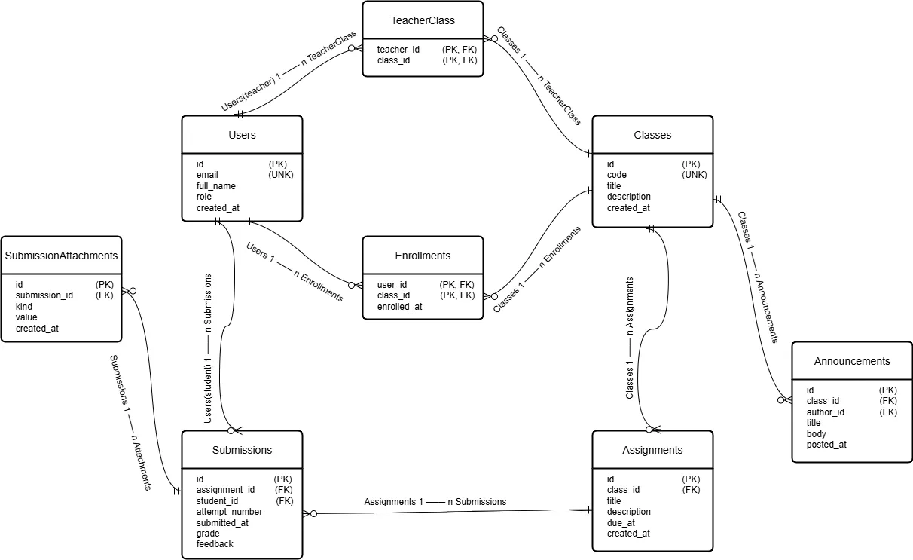

# School-Management-System

### Steps to run 
- Create a virtual environment (Windows 11)
```python
python -m venv venv
Set-ExecutionPolicy -Scope Process -ExecutionPolicy Bypass
.\venv\Scripts\Activate.ps1
```

- Run managementSchema.py to create a relational schema
```python
python managementSchema.py
```

- To populate the tables with dummy data set.
```python
python datapopulate.py
```

- To run the CRUD operations
```python
python managementCrud.py
python managementCrud.py reset    # (optional) rebuilds DB by calling  managementSchema.py first
```
- To create FastAPI app for the LMS schema created by managementSchema.py.
```python
python -m pip install fastapi
pip install uvicorn
```
```uvicorn
uvicorn main:app --reload
```

- Interactive docs:
    http://127.0.0.1:8000/docs


This schema supports users, classes, enrollments, assignments, submissions (with multiple attempts and attachments), and announcements.
The design follows 3NF and includes integrity constraints via foreign keys and triggers.




## Entities
- **Users**: `teacher`, `student`, or `admin`.
- **Classes**: different classes.
- **Teacher_Class**: teachers with assigned classes.
- **Enrollments**: students enrolled in classes.
- **Assignments**: belong to a class, include due dates.
- **Submissions**: students submit assignments; supports multiple attempts and grading feedback.
- **SubmissionAttachments**: one-to-many attachments per submission (`url` or `file`).
- **Announcements**: posted by the class's teacher; visible to all enrolled users.

<!-- ## Key Constraints
- `Users.role` CHECK in ('teacher','student','admin').
- `Classes.teacher_id` FK → `Users(id)` and must have `role='teacher'` (trigger enforced).
- `Enrollments(user_id,class_id)` composite PK; `user_id` must have `role='student'` (trigger).
- `Assignments.class_id` FK → `Classes(id)`.
- `Submissions(assignment_id, student_id, attempt_number)` UNIQUE to allow multiple attempts.
- Submitting user must be enrolled in the class for the assignment (trigger).
- `Announcements.author_id` must equal the class’s `teacher_id` (trigger).

## Indexes
- FKs are indexed: `Classes.teacher_id`, `Enrollments.user_id`, `Enrollments.class_id`,
  `Assignments.class_id`, `Assignments.due_at`, `Submissions.assignment_id`, `Submissions.student_id`,
  `Submissions.submitted_at`, `SubmissionAttachments.submission_id`, `Announcements.class_id`, `Announcements.posted_at`. -->

<!-- ## Example Queries
- All assignments for a class:
  ```sql
  SELECT * FROM Assignments WHERE class_id=? ORDER BY due_at;
  ```
- Students in a class:
  ```sql
  SELECT u.* FROM Enrollments e JOIN Users u ON u.id=e.user_id WHERE e.class_id=?;
  ```
- Latest submission per student for an assignment:
  ```sql
  SELECT s.*
  FROM Submissions s
  WHERE s.assignment_id=?
    AND NOT EXISTS (
      SELECT 1 FROM Submissions s2
      WHERE s2.assignment_id=s.assignment_id
        AND s2.student_id=s.student_id
        AND (s2.attempt_number > s.attempt_number OR (s2.attempt_number = s.attempt_number AND s2.submitted_at > s.submitted_at))
    );
  ``` -->
